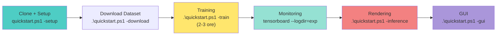

# 🚀 Quick Start E-NeRF su RTX 4060 Ti

**Versione**: Windows 11/10 + Miniconda + CUDA 12.1  
**Hardware**: NVIDIA RTX 4060 Ti (8GB VRAM)  

---

## ⚡ 5 Minuti per Iniziare

### Passo 1: Setup Ambiente (5 min)

```powershell
# Apri PowerShell nella cartella enerf
cd C:\path\to\enerf

# Esegui setup automatico
.\quickstart.ps1 -setup

# Output atteso:
# ✓ Conda trovato
# ✓ GPU trovata: NVIDIA RTX 4060 Ti
# ✓ Moduli compilati
# ✅ Setup completato!
```

### Passo 2: Scarica Dataset (manual)

```powershell
# Opzione A: Download browser
# Visita: https://vision.in.tum.de/research/enerf
# Scarica: mocapDesk2.tar (~200 MB)
# Estrai in: C:\path\to\enerf\data\

# Opzione B: Da PowerShell
.\quickstart.ps1 -download
# (segui le istruzioni per WSL/curl)

# Verifica:
ls .\data\mocapDesk2
# Output: images/, events/, poses_bounds.npy, intrinsics.txt
```

### Passo 3: Avvia Training (2-3 ore)

```powershell
# Training automatico (no config necessario!)
.\quickstart.ps1 -train

# Durante training, in altro PowerShell:
.\quickstart.ps1 -status      # Monitora GPU, CPU
tensorboard --logdir=exp     # View loss curve
```

### Passo 4: Genera Output

```powershell
# Rendering finale
.\quickstart.ps1 -inference

# Scegli modalità:
# [1] Rendering training poses
# [2] Random interpolated video
# [3] 3D mesh per Blender
```

### Passo 5: GUI Interattiva (opzionale)

```powershell
# Visualizza modello in tempo reale
.\quickstart.ps1 -gui

# Controlli: mouse per **rotazione, WASD per movimento
# Premi H per help
```

---

## 📚 Documentazione Completa

| Documento | Contenuto |
|-----------|----------|
| **GUIDA_SETUP_LOCALE.md** | Guida completa (8 sezioni, 500+ linee) |
| **ANALYSIS_PLAN.md** | Piano di profiling e analisi performance |
| **PRACTICAL_PROFILING_GUIDE.md** | Script per misurare bottleneck |
| **configs_custom/rtx4060ti_optimal.txt** | Config commentato (modifica se necesario) |

Consiglio: leggi **GUIDA_SETUP_LOCALE.md** sezione 7 (Troubleshooting) se riscontri problemi.

---

## ⚠️ Problemi Comuni e Fix

### 🔴 **"CUDA out of memory" (VRAM insufficiente)**

**Cause possibili:**
- `fp16` e `ckpt` non abilitati nel config (occupano 36GB senza!)
- `num_rays` troppo alto (default 65536, troppo per RTX 4060 Ti)
- `num_steps` troppo alto (default 128, solo 24 supportato da RTX 4060 Ti)

**Fix immediato:**
```powershell
# Verifica config - DEVONO essere così:
grep "fp16\|ckpt" configs_custom/rtx4060ti_optimal.txt
# Output atteso: 
#   fp16 = 1         (attiva mixed precision)
#   ckpt = 1         (attiva gradient checkpointing)

# Se non ci sono, modifica il file manualmente o usa:
# num_rays = 3072   (5% del default, riduce da 16384 samples a 786 per iter)
# num_steps = 24    (19% del default, coarse+fine=24+24 campioni)
```

**Se ancora OOM:**
```powershell
# Riduci ulteriormente nel config:
# num_rays = 1024       # (ridotto drasticamente, addestramento lento ma fattibile)
# downscale = 3         # (immagini 171×171 invece 512×512)
# num_steps = 16        # (meno campioni per raggio, qualità bassa)
```

**Consiglio**: RTX 4060 Ti ha solo 8GB VRAM. Con fp16+ckpt occupa ~5GB, che è il limite assoluto.

---

### 🟡 **"cl.exe not found" (Visual Studio Build Tools mancanti)**

**Causa**: Compilazione CUDA richiede C++ compiler. Visual Studio Build Tools non installato.

**Fix:**
```powershell
# Opzione A: Download automatico (consigliato)
# 1) Scarica: https://visualstudio.microsoft.com/downloads/
# 2) Installa: "Visual Studio Build Tools 2023"
# 3) Durante install, seleziona:
#    - "Desktop development with C++" checkbox
#    - "MSVC v143 C++ build tools" (selezionato auto)
#    - "Windows 10 SDK" (selezionato auto)
# 4) Dopo install, riavvia PowerShell
# 5) Prova di nuovo: .\quickstart.ps1 -setup

# Opzione B: Verifica manualmente
Get-ChildItem "C:\Program Files*\Visual Studio\2022\*\VC\Tools\MSVC\*\bin\Hostx64\x64\cl.exe" 2>$null
# Se non trova nulla, installa come in Opzione A
```

---

### 🟠 **"NVCC not found" (CUDA Toolkit non installato o non trovato)**

**Causa**: `nvcc` compiler non è in PATH. CUDA 12.1 non installato o installato male.

**Fix:**
```powershell
# Passo 1: Verifica se CUDA è installato
ls "C:\Program Files\NVIDIA GPU Computing Toolkit\CUDA\v12.1\bin\nvcc.exe"
# Se non esiste, scarica e installa CUDA

# Passo 2: Scarica CUDA 12.1
# URL: https://developer.nvidia.com/cuda-downloads
# Seleziona: Windows 11/10, x86_64
# Integrazione con VS 2022: Sì (importante!)

# Passo 3: Dopo install, aggiungi al PATH
# Nota: Di solito automatico, ma se non funziona:
$env:CUDA_HOME = "C:\Program Files\NVIDIA GPU Computing Toolkit\CUDA\v12.1"
$env:PATH = "$env:CUDA_HOME\bin;$env:CUDA_HOME\libnvvp;$env:PATH"

# Verifica:
nvcc --version
# Output atteso: CUDA release 12.1

# Passo 4: Se voglio rendere permanente il PATH
# Modifica Variabili d'Ambiente → User/System variables
# Aggiungi CUDA_HOME = C:\Program Files\NVIDIA GPU Computing Toolkit\CUDA\v12.1
```

---

### 🔴 **"Training diverges" / "PSNR < 10 dB dopo ore"**

**Cause:**
- Learning rate troppo basso (rete non impara abbastanza velocemente)
- Dataset non allineato (poses sbagliate o formato errato)
- Initialization random molto sfavorevole

**Fix:**
```powershell
# Fix 1: Aumenta learning rate nel config
# Modifica: configs_custom/rtx4060ti_optimal.txt
# Da:   lr = 1e-2
# A:    lr = 5e-2    (5x più alto)

# Fix 2: Verifica dataset
ls .\data\mocapDesk2
# Output DEVE contenere:
#   images/             (JPEG/PNG frames)
#   events/             (h5 files con event camera data)
#   intrinsics.txt      (calibrazione camera 3×3)
#   poses_bounds.npy    (camera poses + scene bounds)

# Fix 3: Riavvia training da zero (elimina checkpoint vecchio)
rm -r .\exp\enerf_rtx4060ti
.\quickstart.ps1 -train
```

---

### 🟡 **"GPU throttles / training becomes slow"**

**Causa**: Thermal throttling. RTX 4060 Ti ha TDP 70W ma cluster termico stretto. Tempera ~75°C è limite.

**Fix:**
```powershell
# Monitorare temperatura durante training
.\quickstart.ps1 -status
# Guarda "temperature.gpu" - dovrebbe essere < 75°C

# Se > 80°C:
# 1) Migliora ventilazione (apri case, aggiungi ventole)
# 2) Pulisci dust filter (ogni 6 mesi)
# 3) Riduci num_rays per ridurre carico GPU
#    num_rays = 1024 (invece 3072)
```

---

### 🔴 **"ModuleNotFoundError: No module named 'gridencoder'" (dopo setup)**

**Causa**: Compilazione CUDA fallita silenziosamente. Solito Visual Studio Build Tools mancanti.

**Fix:**
```powershell
# Vedi "cl.exe not found" sopra - è la causa del 95% dei casi

# Se hai VS Build Tools ma ancora non funziona:
# 1) Elimina build cache
rm -r gridencoder/build gridencoder/*.egg-info
rm -r raymarching/build raymarching/*.egg-info
rm -r shencoder/build shencoder/*.egg-info
rm -r ffmlp/build ffmlp/*.egg-info

# 2) Ricompila
conda run -n enerf pip install -e gridencoder
conda run -n enerf pip install -e raymarching
conda run -n enerf pip install -e shencoder
conda run -n enerf pip install -e ffmlp

# 3) Verifica:
conda run -n enerf python -c "from gridencoder import GridEncoder; print('OK')"
```

---

### 🟠 **"FileNotFoundError: poses_bounds.npy not found"**

**Causa**: Dataset non estratto correttamente, o cartella dati sbagliata.

**Fix:**
```powershell
# Verifica struttura dataset
ls .\data\mocapDesk2\

# Output DEVE essere (non le sottocartelle):
#     Directory: C:\Users\...\enerf\data\mocapDesk2
#     intrinsics.txt
#     poses_bounds.npy
#     images/
#     events/

# Se manca, il tar non è stato estratto correttamente:
# 1) Se tarball ancora c'è:
cd .\data
tar -xf mocapDesk2.tar    # (riestrarre anche se già fatto)

# 2) Se tarball non c'è, ri-scarica:
.\quickstart.ps1 -download
```

Vedi **GUIDA_SETUP_LOCALE.md sezione 7** per più troubleshooting.

---

## 🎯 Workflow Tipico



---

## 📊 Performance Aspettato

**Sulla tua RTX 4060 Ti**:

```
Setup:      ~5 minuti
Download:   ~10 minuti (dipende internet)
Training:   ~2-3 ore (10k iterazioni)
Rendering:  ~5 minuti
─────────────────────────────
TOTALE:     ~3 ore per full pipeline

Expected results:
  - PSNR finale: 22-24 dB (buona qualità)
  - Model size: ~50 MB
  - Memory picco: ~5 GB (safe per 8GB VRAM)
```

---

## 🔧 Parametri Configurabili

Se vuoi sperimentare, modifica **configs_custom/rtx4060ti_optimal.txt**:

```ini
# Per GPU con meno memoria:
num_rays = 1024          # (default 3072)
num_steps = 16           # (default 24)

# Per GPU con più memoria (RTX 3090+):
num_rays = 16384         # (default 3072)
num_steps = 64           # (default 24)

# Per training più veloce:
downscale = 3            # (default 2, 512×512 → 171×171)
iters = 5000             # (default 10000, meno iterazioni)

# Per training più preciso:
num_steps = 48           # (default 24, più campioni per raggio)
```

Dopo ogni modifica, riavvia training:
```powershell
.\quickstart.ps1 -train
```

---

## 📖 Prossimi Step Avanzati

**Dopo il primo training**, se interessato:

1. **Profiling Performance**: 
   - Leggi `PRACTICAL_PROFILING_GUIDE.md`
   - Esegui `python scripts/profile_inference_ff.py`
   - Misura bottleneck (memoria vs compute)

2. **Training su Nuovi Dati**:
   - Scarica dataset TUM-VIE o EDS
   - Esegui preprocessing (vedi `GUIDA_SETUP_LOCALE.md` sezione 2.4)
   - Crea config custom

3. **Optimization Codice**:
   - Implementa feedback loop da profiling
   - Testa varianti architettura (FFMLP vs TCNN)
   - Sperimenta hyperparameter

---

## 🤔 FAQ

**Q: Posso usare un GPU diverso (RTX 3090, RTX 4090, ecc)?**

A: Sì! Modifica `configs_custom/rtx4060ti_optimal.txt`:
```ini
# RTX 3090 (24GB): aumenta sample rate
num_rays = 16384
num_steps = 64

# RTX 4090 (24GB): full quality
num_rays = 65536
num_steps = 128
```

**Q: Quanto tempo prende training su RTX 4060 Ti?**

A: ~2-3 ore per 10k iterazioni con config ottimale.
   Se vuoi più veloce: riduci `iters = 5000`

**Q: Posso interrompere training e continuare dopo?**

A: Sì! Training salva checkpoint ogni 500 iterazioni.
   Riavvia: `.\quickstart.ps1 -train`
   Continuerà automaticamente da ultimo checkpoint.

**Q: Come esporto il modello per usarlo altrove?**

A: Model weights in: `exp/enerf_rtx4060ti/ckpt_10000.pth`
   Per mesh 3D: `.\quickstart.ps1 -inference` → scegli opzione 3

---

## 📞 Supporto e Risorse

| Risorsa | Link |
|---------|------|
| **E-NeRF Paper** | https://arxiv.org/abs/2208.11300 |
| **Dataset Download** | https://vision.in.tum.de/research/enerf |
| **NVIDIA CUDA Docs** | https://docs.nvidia.com/cuda/ |
| **PyTorch Docs** | https://pytorch.org/docs/ |
| **GitHub Issues** | https://github.com/knelk/enerf/issues |

---

## 🎓 Struttura Cartelle Dopo Setup

```
enerf/
├── main_nerf.py              ← main script
├── environment.yml           ← conda dependencies
├── GUIDA_SETUP_LOCALE.md     ← full guide
├── ANALYSIS_PLAN.md          ← performance analysis
├── PRACTICAL_PROFILING_GUIDE.md
├── quickstart.ps1            ← this magic script
│
├── nerf/                      ← model code
│   ├── network.py
│   ├── network_ff.py         ← FFMLP variant
│   ├── renderer.py
│   ├── provider.py
│   └── ...
│
├── configs_custom/
│   └── rtx4060ti_optimal.txt ← YOUR config
│
├── data/                      ← datasets
│   └── mocapDesk2/           ← download qui
│       ├── images/
│       ├── events/
│       ├── poses_bounds.npy
│       └── intrinsics.txt
│
└── exp/                       ← experiment outputs
    └── enerf_rtx4060ti/
        ├── ckpt/            ← checkpoints
        ├── results/         ← rendering output
        └── logs/            ← tensorboard logs
```

---

**Last Updated**: Aprile 2026

**Ready to go?** Esegui:
```powershell
.\quickstart.ps1 -setup
```

Buona fortuna! 🚀
